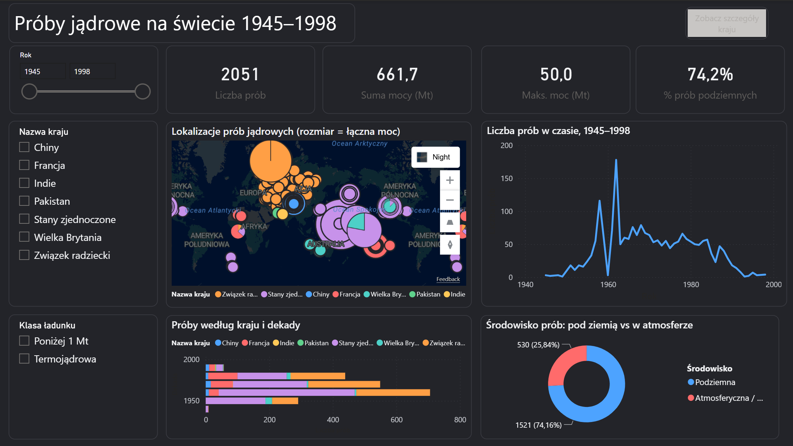
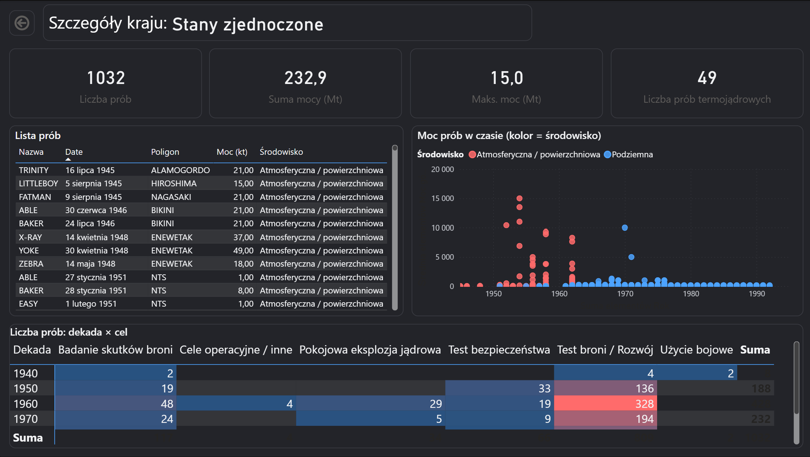
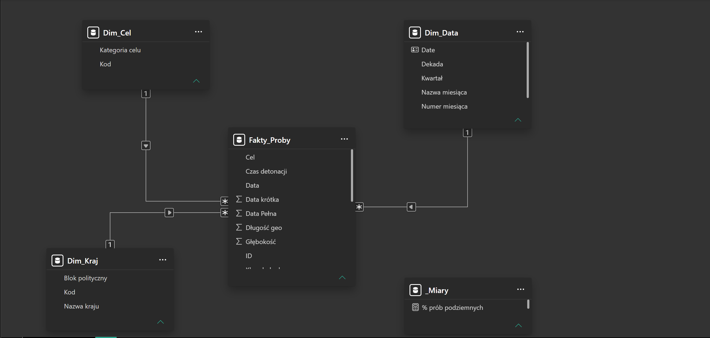

# Nuclear Explosions 1945-1998 - Power BI Dashboard

An interactive Power BI report analysing **2,051 nuclear explosions** conducted by 7 countries between 1945 and 1998, based on the SIPRI / FOI dataset.

The goal was not just to plot the data, but to tell the story hidden in it: how two superpowers dominated the arms race, how a single treaty in 1963 pushed testing underground, and how nuclear weapons slowly spread to new countries.



---

## Key findings

- **A two-player race** - the USA (1,032) and the USSR (714) account for ~85% of all tests.
- **One treaty changed everything** - 74% of all tests were conducted underground, a direct effect of the 1963 Partial Test Ban Treaty, which banned atmospheric testing.
- **Diplomacy is visible in the data** - the sharp drop in 1959–60 followed by a spike in 1961–62 matches the US–Soviet testing moratorium (1958–1961) and its collapse.
- **Extremely uneven power** - most tests were relatively small, while 127 thermonuclear-class detonations (≥ 1 Mt) account for the bulk of the total yield. The largest one, the Tsar Bomba (1961), reached ~50 Mt.

---

## Report structure

### 1. Overview
KPI cards, a world map of test sites (bubble size = total yield), tests over time, tests by country and decade, and the underground vs. atmospheric split. Slicers for year range, country and yield class.

### 2. Country details (drill-through)
Select a country on the map and click **"Zobacz szczegóły kraju"** to open a page filtered to that country: KPIs, a list of all its tests, a yield-over-time scatter plot and a decade × purpose matrix with a colour-scale heatmap (conditional formatting).



---

## Data model

Star schema built from a single flat CSV file:

| Table | Type | Description |
|---|---|---|
| `Fakty_Proby` | Fact | One row = one test event (grain), with yield, location and method |
| `Dim_Data` | Dimension | Continuous calendar 1945–1998 (year, quarter, month, decade), marked as date table |
| `Dim_Kraj` | Dimension | 7 countries with full names and geopolitical bloc |
| `Dim_Cel` | Dimension | Lookup table mapping 28 raw SIPRI purpose codes into 6 readable categories |

All relationships are **many-to-one (`*:1`)** with **single-direction** filtering from dimensions to the fact table.



---

## Data preparation (Power Query)

- Renamed columns and set data types (decimal values parsed with the en-US locale).
- Built a proper date column from the `YYYYMMDD` integer.
- Derived columns:
  - **Environment** (underground / atmospheric) — derived from the detonation *method*, not from `depth`, which is mostly empty in the source.
  - **Yield class** — thermonuclear-class (≥ 1 Mt) vs. below threshold.
- Collapsed 28 purpose codes (incl. combined ones like `WR/SE`, `PNE:PLO`) into 6 categories via a dedicated lookup table.

---

## DAX measures

7 measures, including:

```dax
% prób podziemnych =
DIVIDE(
    CALCULATE([Liczba prób], Fakty_Proby[Środowisko] = "Podziemna"),
    [Liczba prób]
)
```

```dax
Średnia moc (kt) =
AVERAGEX(
    FILTER(Fakty_Proby, Fakty_Proby[Moc górna (kt)] > 0),
    Fakty_Proby[Moc górna (kt)]
)
```
Tests with unknown yield are stored as `0` in the source — they are excluded so they don't pull the average down.

```dax
Moc narastająco (Mt) =
CALCULATE(
    [Suma mocy (Mt)],
    FILTER(ALL(Dim_Data[Date]), Dim_Data[Date] <= MAX(Dim_Data[Date]))
)
```

Other measures: test count, total yield (Mt), max yield (Mt), number of thermonuclear-class tests.

---

## Data limitations

- **Yield is an estimate** (lower / upper bound), not a measurement. The report uses the upper bound.
- **Thermonuclear class is a yield threshold**, not a physical classification — some thermonuclear devices were tested at reduced yield.
- **The dataset counts test events, not individual devices.** Several devices detonated simultaneously form one record — this is why India (3) and Pakistan (2) have fewer rows than the number of devices they declared in 1998.
- 24 records have missing coordinates (`0, 0`) and are filtered out of the map only.

---

## Tech stack

Power BI Desktop · Power Query (M) · DAX

## Data source

SIPRI / FOI — *Nuclear Explosions 1945–1998* (N.-O. Bergkvist, R. Ferm).
CSV obtained via [data-is-plural/nuclear-explosions](https://github.com/data-is-plural/nuclear-explosions).

## How to open

Download `SIPRI_nuclear_explosions.pbix` and open it in [Power BI Desktop](https://www.microsoft.com/power-bi/desktop) (free, Windows).

---

*Built as a graded project for the Data Visualization course at Collegium Da Vinci (Poznań). Report language: Polish.*
